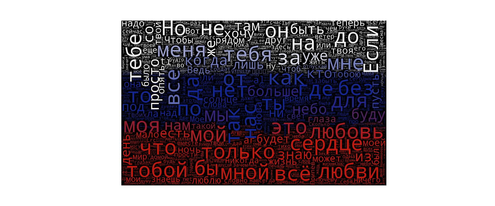
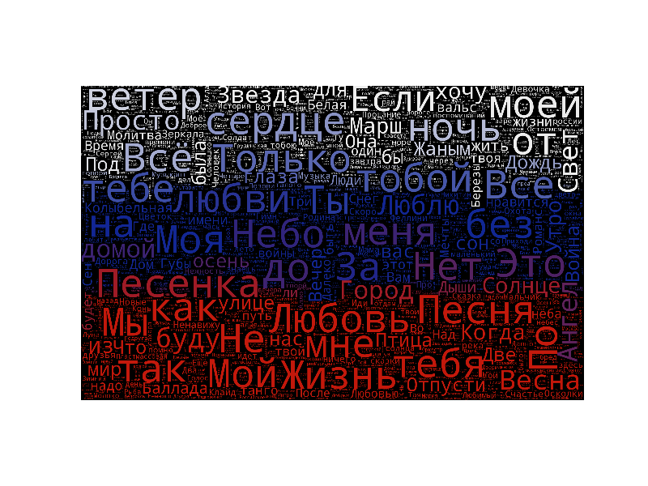

# Netease-music-Russian

基于[darknessomi](https://github.com/darknessomi/musicbox/blob/master/NEMbox/api.py)的网易云音乐Api实现

想找些好听的俄语歌听听，爬了小语种分类下所有的俄语歌曲，自己生成了一张歌单，按评论量排序

#### 想感受下战斗民族的歌曲文化可以听听
[歌单链接](http://music.163.com/#/my/m/music/playlist?id=498254588)

#### 顺带着把歌词趴下来了，那就顺便统计一下出现在俄语歌曲中高频俄语单词

#### 再统计一下歌名中出现的高频俄语单词

